[![IBM Cloud powered][img-ibmcloud-powered]][url-ibmcloud]

# Watson Visual Recognition
Aplicacion que nos permitirará subir una imagen para que el servicio de IBM CLOUD lo analice, y haga un reconocimiento con base en una clasificación que se entrenara de manera personalizada, mas una clasificación de manera general que el servicio ya tiene pre-entrenada. Y despliegalo en una app directamente a IBM Cloud!

[![IBM Visual Recognition][img-visual]][url-visual] 
[![Demo Visual Recognition][img-demovisual]][url-demovisual]

# IBM Recipe - Visual recognition 
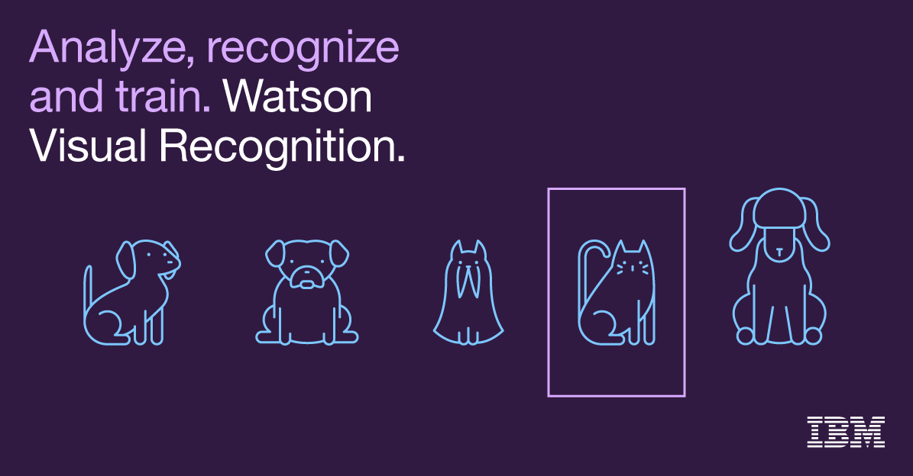  

## Antes de empezar te recomendamos:
* Realizar el [PreWork][url-prework].
* Si eres estudiante o profesor y tienes correo institucional te recomendamos los [Cupones][url-cupones].
* Si tienes algun codigo promocional te decimos como [Aplicarlos][url-aplica].

[url-prewokr]: https://github.com/ibmdevelopermx/Cloud-Apps-Serie#Prework
[url-cupones]: https://github.com/ibmdevelopermx/Cloud-Apps-Serie#Cupones-para-profesores-y-estudiantes
[url-aplica]: https://github.com/ibmdevelopermx/Cloud-Apps-Serie#Cargar-cr%C3%A9ditos-en-IBM-Cloud

## 1. Crea el Servicio de Watson Studio
Entra a [**IBM Cloud**](https://cloud.ibm.com/) e ir a la sección de catálogo.   
    
Buscar el servicio “Watson Studio” (Escríbelo en el buscador o encuéntralo en la sección “AI”) y crear el servicio.  
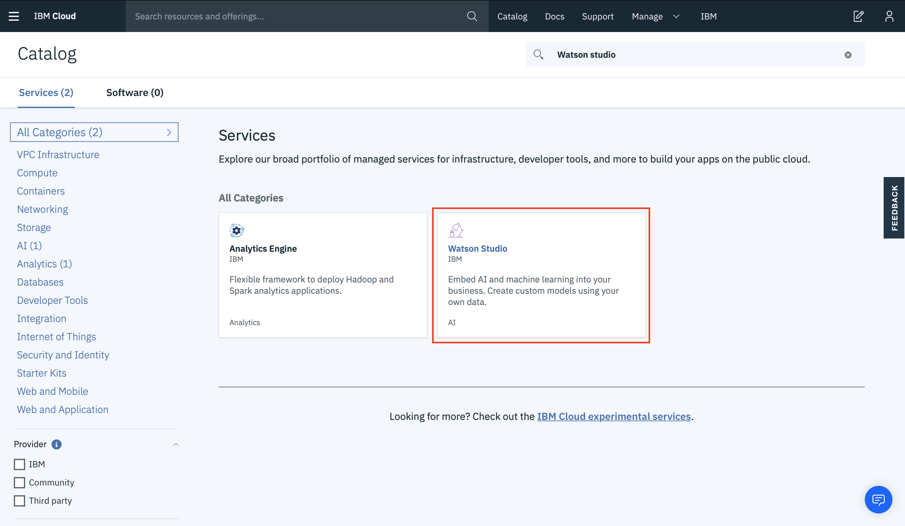 
  
## 2.	Crear el Servicio de Visual Recognition
Dentro de [**IBM Cloud**](https://cloud.ibm.com/) ir a la sección de catálogo.  
 
Buscar el servicio “Visual Recognition” (Escríbelo en el buscador o encuéntralo en la sección “AI”) y crear el servicio.  
  
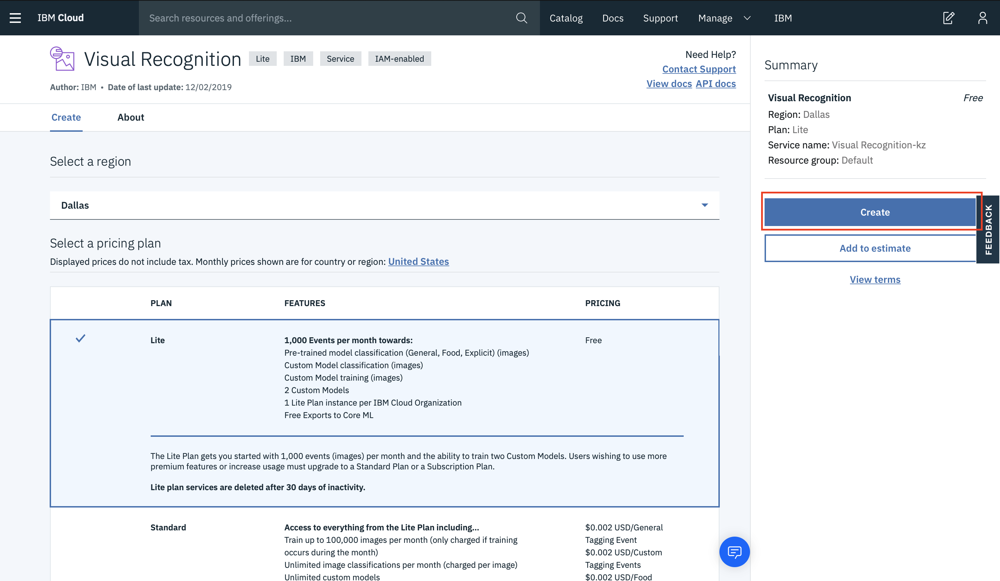  
Ir a "Manage” y dar click en “Create a custom model”  
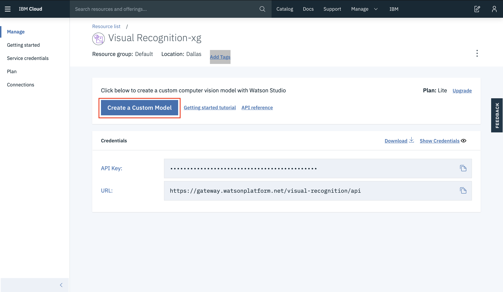  
Automaticamente se creará el servicio de “Object Storage”. 

## 3.	Crear el modelo un modelo en Visual Recognition
### Dentro del panel de Visual Recognition, realizar los siguientes pasos:
      •	En el apartado de "Classify Images" hacemos clic en “Create Model”
    
   
      •	Ingresamos el nombre “Tacos”.
      •	Seleccionamos los servicios anteriormente creados (Watson Studio y Object Storage).
      •	Hacemos clic en el botón “Create”.
   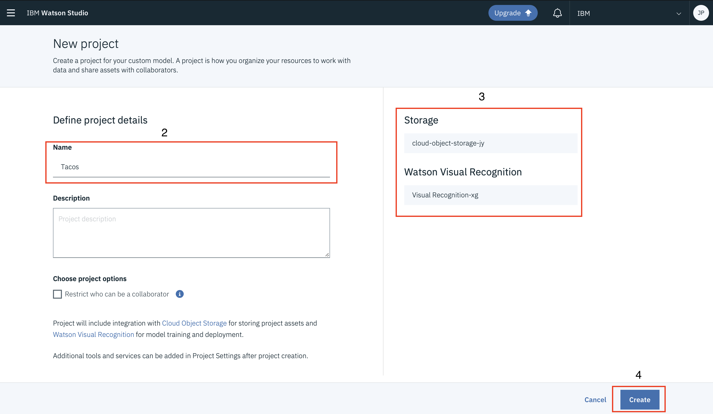  
   
## 4.	Agrega archivos al proyecto y entrena el modelo
        •	Cambiamos el nombre del Modelo por “Tipos de tacos”
     
   
        •	Agregamos los archivos .zip que se encuentran en la carpeta 
        “Tacos imágenes” (del repositorio) en el área de “Upload to Project”
   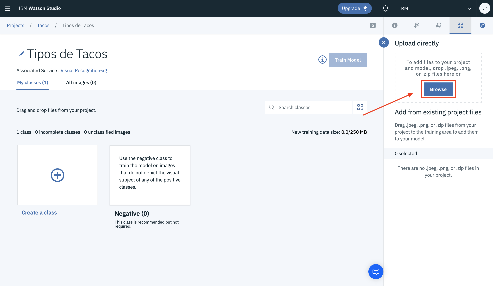  
   
        •	Seleccionamos todos los archivos importados y hacemos clic en “Add to model” 
     

        •	Una vez cargadas las fotos podremos observaremos que aparece “Ready to train”
        y haremos clic en “Train model”.
   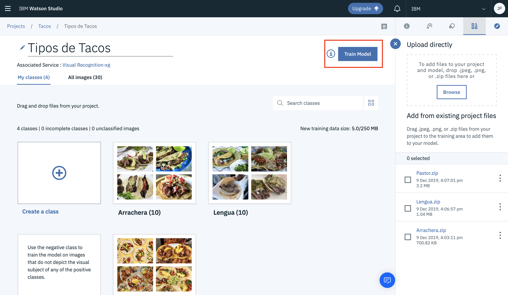  
   
        •	Una vez finalizado el entrenamiento podremos probarlo con el archivo “pastor.jpg”
        que se encuentra en la carpeta "Imagenes Prueba" de este repositorio
   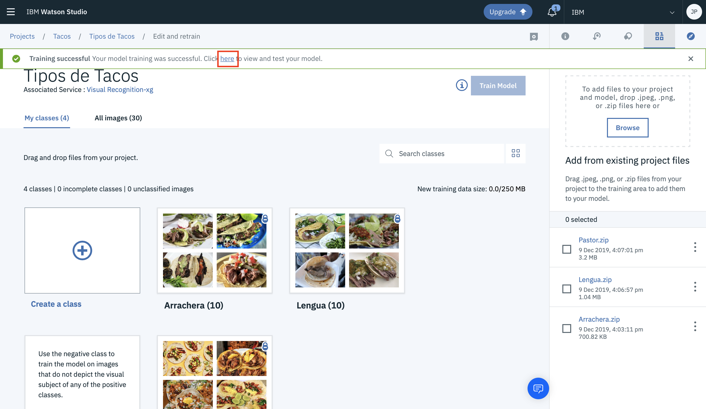  
   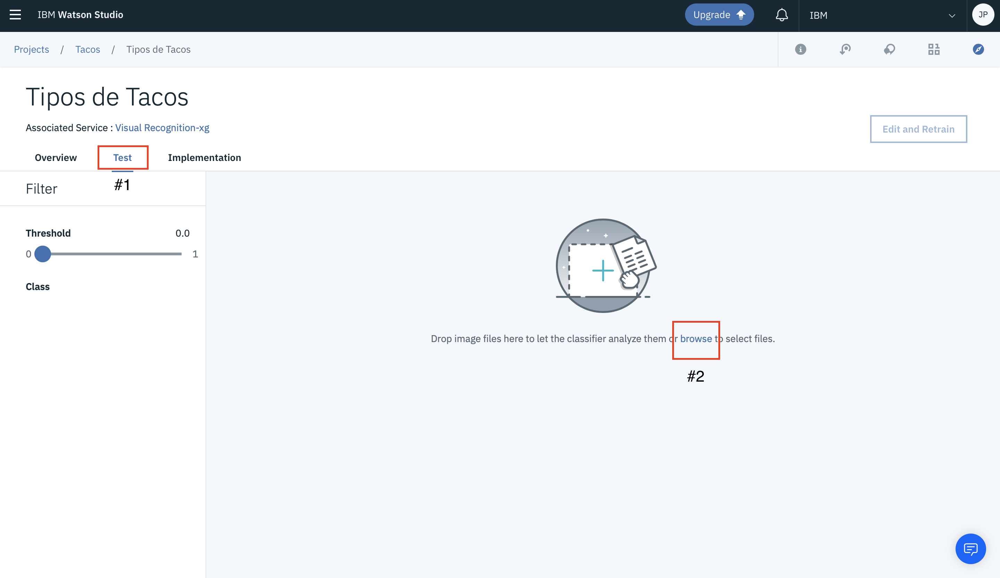  
   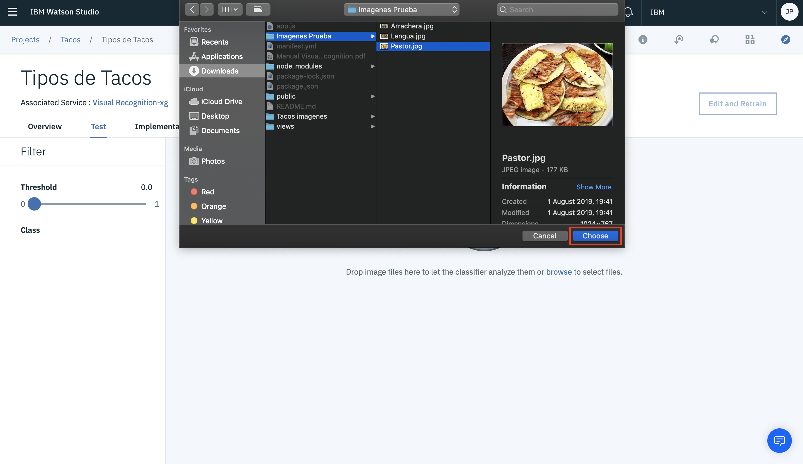  
   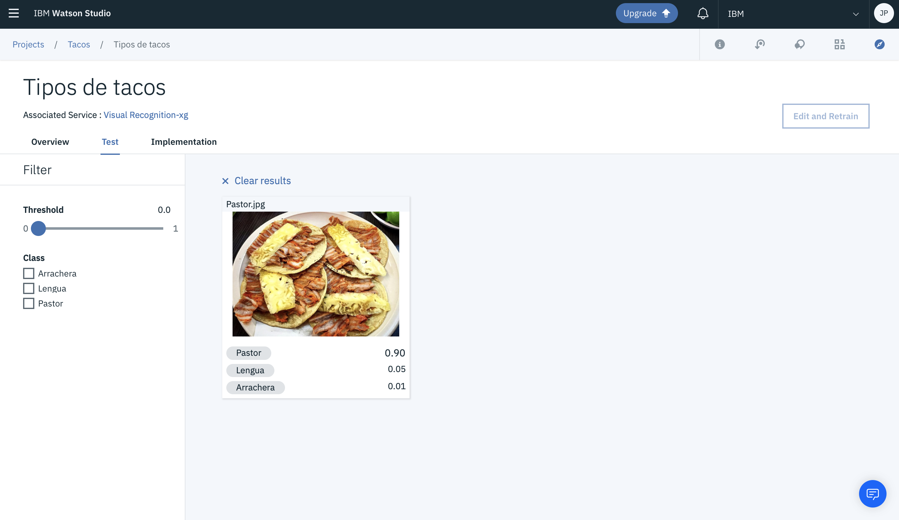  

## 5.	Obtenga las credenciales del servicio 
 Abra una nueva pestaña en su navegador para acceder a [**IBM Cloud**](https://cloud.ibm.com/login). 
         
         En el panel de control, haga clic en el servicices > VisualRecognition
         
 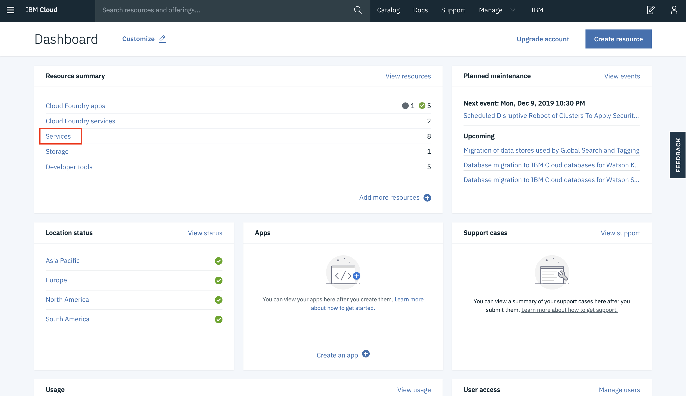  
Ir a la pestaña "ServiceCredentials", dirigete a las credenciales "writer" y da clic en ver credenciales.  
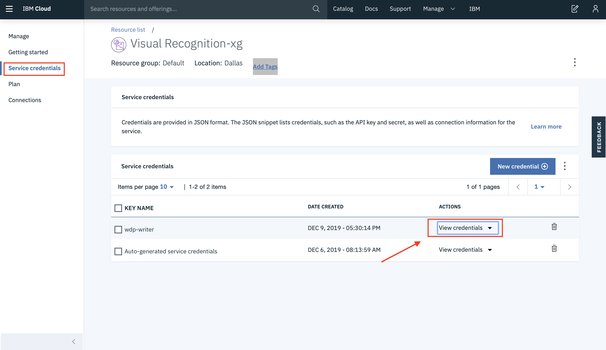  
Copia las credenciales en el editor de texto de tu preferencia para que podamos usarlas más tarde. Las credenciales se verán como estas:  
  
## Nota: NO Utilizar las "Auto Generated Credentials"  

## 6.	Probando la app 
   Descarga este repositorio a tu computadora.  
   Abrimos el archivo “app.js” que se encuentra en este repositorio.  
   Copiamos el “apikey” de las credenciales que copiamos en el paso anterior y la colocamos en la variable “iam_apikey”. 
     
   Para obtener el model ID vamos al apartado Tipos de Tacos y copiamos como a continuación se indica. 
   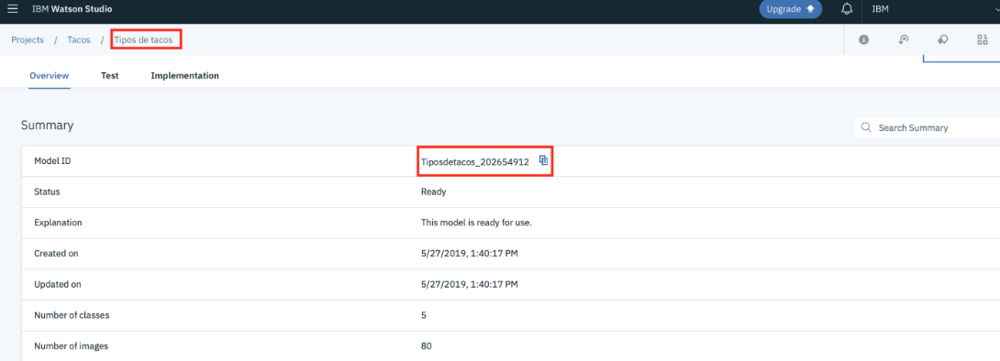  
   Lo sustituimos en la variable “classifier_ids” de nuestro documento “app.js”. 
     
   Abrir terminal y correr los siguientes comandos dentro de la carpeta donde se encuentra este repositorio: 
      
      1.	Ingresar: npm install 
      2.	Ingresar: npm start
      
   Dirigirse al localhost en el puerto “8080 ” introduciendo esta [**liga**](http://localhost:8080/)   
   Da click en el botón "Archivo" y selecciona la imagen “pastor.jpg” para probar la aplicación. 
   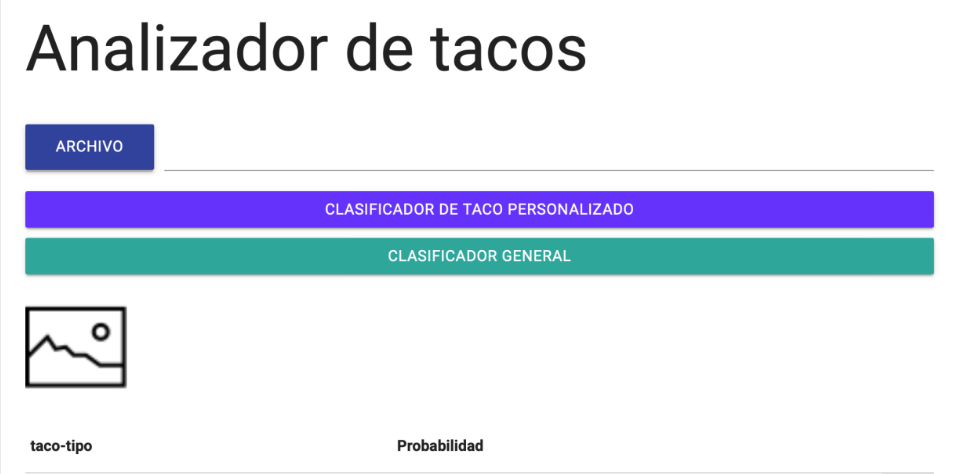  
    Damos clic en el botón “Clasificador de taco personalizado“ para utilizar el modelo que acabamos de crear y observar el resultado. 
   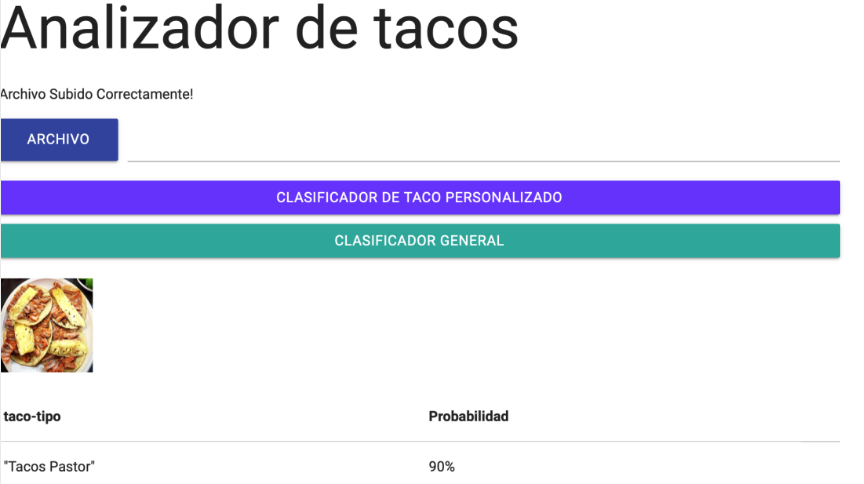  
    Ahora seleccionamos el archivo “lengua.jpg”y hacemos clic en el botón “Clasificador general” para utilizar el clasificador por defecto de Watson Visual Recognition y observa el resultado.
   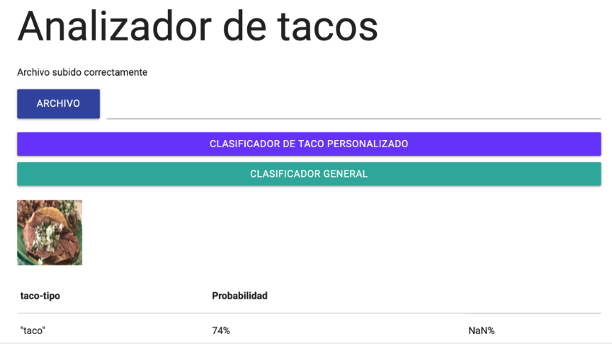  
   
## 7.	Desplegar app en la nube 
Sube la carpeta en donde tienes la app a un repositorio propio de GitHub. Si no sabes hacerlo puedes seguir las instrucciones [**aqui**](https://gist.github.com/cgonzalezdai/cc33db72a6fe5178637aabb562eae35c) 
Puedes desplegar esta aplicación como una Cloud Foundry application hacia IBM Cloud dando click en el botón de abajo. Esta opción creará una deployment pipeline, con un Git lab project hosteado y una devops toolchain.     

    

     Damos clic en "Get started  
     
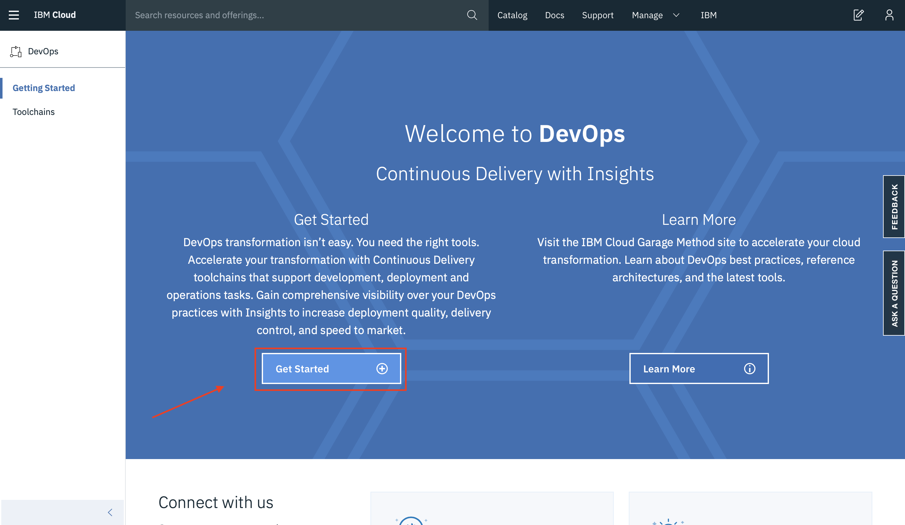  

    Ingresamos en la opción "Develop a Cloud Foundry app".
    
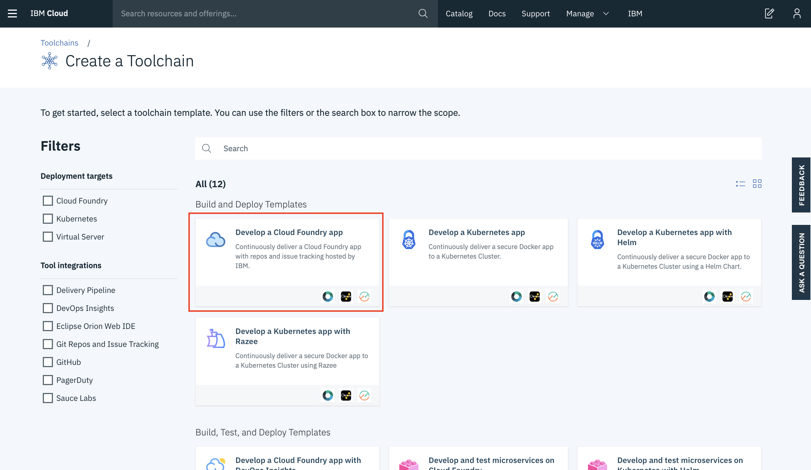  

    Ingresamos el link del repositorio de Git en el recuadro marcado.
    
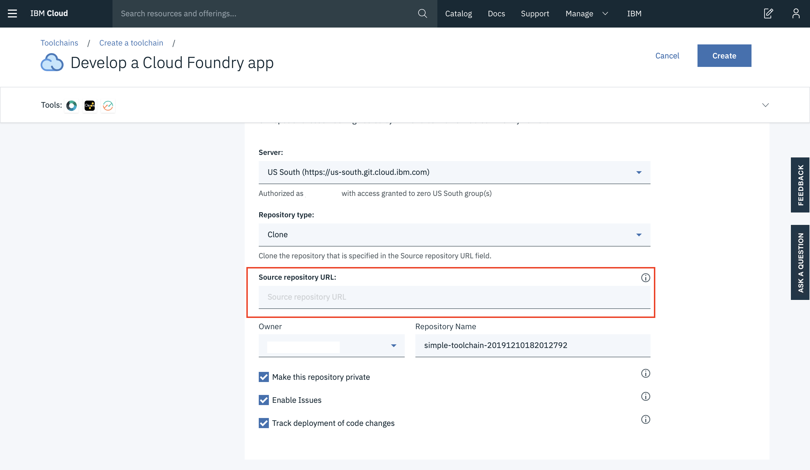  

    Ahora nos vamos al apartado de "Delivery Pipeline" y creamos una IBM Cloud API Key con el botón "create + ".
    
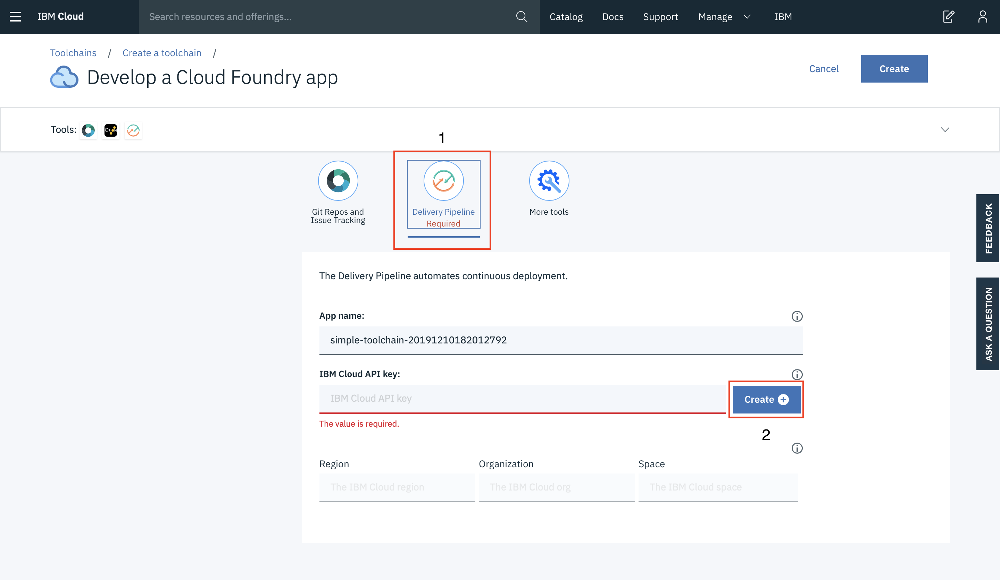  

    Damos clic en el botón "Create" de la parte superior y esperamos a que se despliegue nuestra app.
    
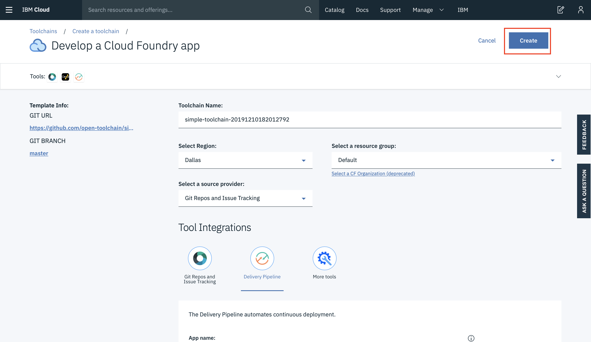  

Podemos consultar el URL de la app esperando a que el despliegue termine ó buscando la app en el dashboard de IBM Cloud, damos clic en el nombre de la app, y damos click en el URL de la Overview page para abrir la app en una nueva pestaña en el navegador. 

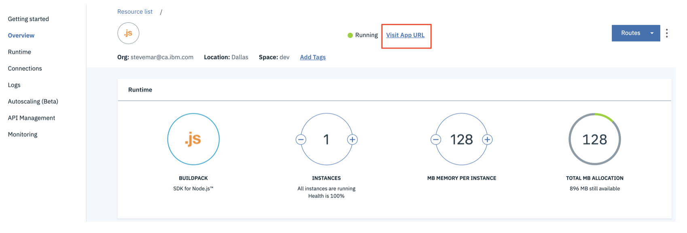  

[img-ibmcloud-powered]: https://img.shields.io/badge/IBM%20Cloud-Powered-blue.svg
[url-ibmcloud]: https://www.ibm.com/cloud/
[img-visual]: https://img.shields.io/badge/IBM%20Cloud-Watson%20Visual%20Recongnition-blue.svg
[url-visual]: https://www.ibm.com/cloud/watson-visual-recognition
[img-demovisual]: https://img.shields.io/badge/DEMO-Watson%20Visual%20Recongnition-red.svg
[url-demovisual]: https://watson-visual-recognition-duo-dev.ng.bluemix.net/